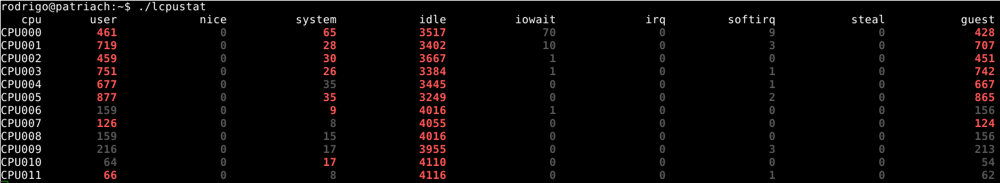

# lcpustats
*lcpu displays in a top(1) style the CPU stats*

# Usage
Just run lcpustats

`./lcpustats`

There is no argument.

# Displayed informations

lcpustats displays the amount of time the CPU has spent performing different kinds of work since lcpustats was started.
Time units are in USER_HZ or Jiffies and all the data comes from /proc/stats.
The display is refreshed every second. and if between two refreshes a values changes, the number is printed in red.

The printed values are :

* user: normal processes executing in user mod
* nice: niced processes executing in user mode
* system: processes executing in kernel mode
* idle: twiddling thumbs
* iowait: waiting for I/O to complete
* irq: servicing interrupts
* softirq: servicing softirqs
* lcpustats uses ansi escape codes to format and color.

# Download & Build

| Version | Sources | Checksum |
|---------|---------|----------|
| v0.1    | [lcpustats-0.1.tgz](http://files.bebik.net/lcpustats/lcpustats-0.1.tgz) | [lcpustats-0.1.sum](http://files.bebik.net/lcpustats/lcpustats-0.1.sum) |

Build sequence :

    % tar xzf lcpustats-0.1.tgz
    % cd lcpustats-0.1
    % cc lcpustats.c -o lcpustats

You can now run or copy the lcpustats binary.

# Screenshots

